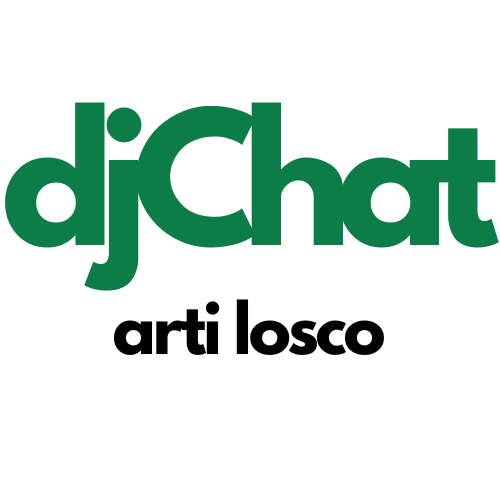

[![LinkedIn][linkedin-shield]][linkedin-url]

<!-- PROJECT LOGO -->
 

  

<h3 align="center">Django djChat</h3>

  

    A Django Chat application using django REST Framework & React
     
    <a href="https://github.com/LoscoArti/djchat_v1.0"><strong>Explore the docs »</strong></a> // replace the link
     
     
  

[linkedin-shield]: https://img.shields.io/badge/-LinkedIn-black.svg?style=for-the-badge&logo=linkedin&colorB=555
[linkedin-url]: https://www.linkedin.com/in/arti-losco-ba1571195/
